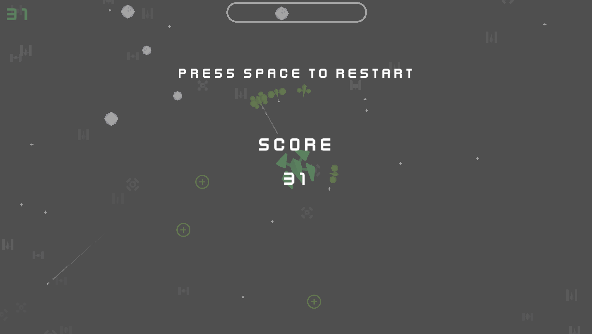

    

# Galactic-Battle
Galactic-Battle is my submission for Kenney Jam 2022.

## Background
You are all alone, all your allies are destroyed by your enemy ships and you are their next target. There is just a little hope left, and that is their ships are driven by Artificial Intelligence, which is pretty weak at detecting Meteors, you can also collect the remains of the destroyed ships to grow your ships size which can make it easier to fight them, but be careful, Big Size also comes with Big Issues. You can't dogde between two Meteors easily, you can be detected from far away by enemies.

    
    
    
    

## Compile
To compile the project, you will need the .NET Framework, and [Raylib_cs](https://github.com/ChrisDill/Raylib-cs).

Clone this repo and execute ``dotnet run`` command in the ``/Galactic-Battle`` Directory.